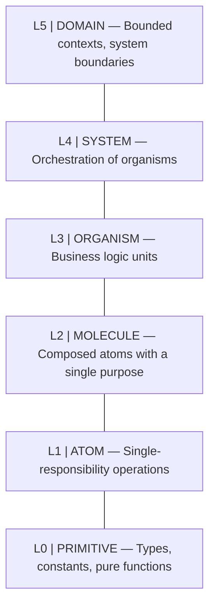
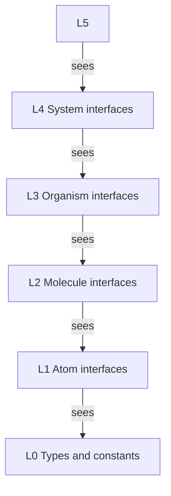

# Abstraction Layers
### Pillar 1 of ARIA — WHERE each piece lives

---

## The Layer Model

ARIA defines six abstraction layers. Each layer has a strict import rule: **a layer may only depend on the layer immediately below it.** No skipping, no circular references.



---

## Layer Definitions

### L0 — Primitive
- Pure data types, value objects, constants, mathematical operations
- **No side effects. Ever.**
- No dependencies outside L0
- Examples: `EmailAddress`, `PositiveInteger`, `Timestamp`, `clamp(n, min, max)`
- AI context needed: minimal. These are vocabulary, not logic.

### L1 — Atom
- Single-responsibility operations: one thing, one reason to exist
- May depend on L0 only
- Stateless preferred; if stateful, state is explicitly declared
- Examples: `hashPassword(raw) → Hash`, `validateEmail(s) → Email|Error`, `generateUUID() → UUID`
- **This is where the "lego studs" are defined** — atoms are the universal connection surface

### L2 — Molecule
- Composes 2–N atoms to fulfill one domain sub-purpose
- May depend on L0 and L1 only
- Has exactly one named purpose derivable from its inputs/outputs
- Examples: `createVerifiedUser(data) → User|Error` (validates + hashes + structures)
- AI can understand a molecule by reading its atom contracts alone — implementation is optional context

### L3 — Organism
- Encodes business rules and domain decisions
- May depend on L0, L1, L2
- This is where "why" lives — business logic, policies, workflows
- Examples: `registerUserWorkflow`, `processPaymentPolicy`, `auditLogEmitter`
- Organisms are the primary target of feature development

### L4 — System
- Orchestration layer — wires organisms together into flows
- No business logic allowed at this layer (only routing, sequencing, error handling)
- Examples: `UserOnboardingSystem`, `PaymentProcessingPipeline`
- AI working here only needs Organism contracts, not their implementations

### L5 — Domain
- Bounded context boundaries and integration surfaces
- Defines what is exposed externally and what is internal
- Anti-corruption layers live here
- Examples: `AuthDomain`, `BillingDomain`, `NotificationDomain`
- AI working here orchestrates entire systems; operates at maximum abstraction

---

## The Layer Contract Rule

```
import Rule: layer[N] → depends_on → any layer[M] where M < N

VALID:   Organism (L3) → Molecule (L2)
VALID:   Organism (L3) → Atom (L1)       ← direct use of atoms is allowed
VALID:   Organism (L3) → Primitive (L0)  ← direct use of primitives is allowed
INVALID: Atom (L1) → Organism (L3)       ← inversion: lower depends on higher
INVALID: Molecule (L2) → System (L4)     ← inversion
INVALID: Molecule → Molecule             ← same-layer coupling (except via declared interface)
```

The rule is **strictly directional** (no inversions, no cycles), not strictly adjacent. A higher layer may use any lower layer directly — but it should prefer the nearest layer to minimize coupling surface. Skipping layers is allowed but should be a conscious, documented choice in the ARU manifest, not a default behavior.

**Same-layer coupling** is allowed only through explicitly declared interfaces (not direct implementation references). This prevents horizontal spaghetti.

---

## Why Layers Optimize AI Context

An AI working at **Layer 3 (Organism)** needs:
- The contracts of Layer 2 molecules it uses: ~200 tokens each
- The Layer 3 ARU manifest: ~150 tokens
- **Total working context: ~600–1200 tokens** for most organisms

It does **NOT** need:
- Layer 1 atom implementations
- Layer 0 primitive definitions
- Layer 4+ orchestration logic

This creates a natural **context budget** per layer. The AI can confidently operate within a layer's "surface area" — the set of contracts exposed upward — without reading downward.

---

## Layer Surface Area

Each layer exposes a **surface** — a set of typed contracts — to the layer above. This surface is:
- Small (only what is needed)
- Stable (rarely changes)
- Typed (no ambiguity)
- Versioned (changes are explicit)

The surface area of each layer is the **only thing the layer above is allowed to know.**



---

## Emergent Property: Isolated AI Work Zones

Each layer becomes an isolated "work zone" for an AI agent. An agent assigned to Layer 2 work:
- Knows its input and output types (from L0/L1)
- Knows available atoms to compose (from L1 surface)
- Does not need to understand the system that will consume it
- Cannot accidentally break Layer 4+ by changing Layer 2 internals

This is the **containment principle**: AI mistakes are layer-bounded.

---

## Influences

The layer naming (Atom, Molecule, Organism) is adapted from **Atomic Design** by Brad Frost (2013), which proposed the same chemistry metaphor for UI component hierarchies. ARIA extends it with Primitive (L0), System (L4), and Domain (L5), and applies it to software modules rather than UI components.

The strict unidirectional dependency rule — each layer may only depend on layers below it — is the central structural rule of **Clean Architecture** (Robert C. Martin, 2017) and **Hexagonal Architecture** (Alistair Cockburn, 2005). ARIA enforces it mechanically via `aria-build check` rather than by convention.

The L5 Domain layer maps directly to a **Bounded Context** from **Domain-Driven Design** (Eric Evans, 2003). See `22-domain-decomposition.md` for the full protocol.
