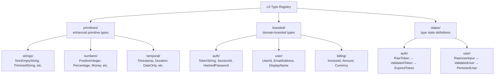
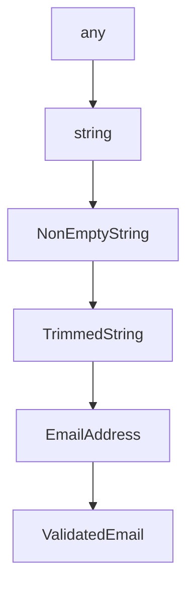
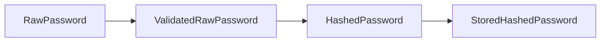

# The Type System
### Second Iteration — The formal foundation beneath all ARU contracts

---

## Why Types Are the Real Documentation

In ARIA, **the type signature of an ARU is its primary documentation**. Not comments, not READMEs, not prose in manifests. The types.

If types are expressive enough, an AI can understand what an ARU does, what it accepts, what it rejects, what state the data is in, and what can go wrong — all from reading the signature alone.

> **The goal**: a type system where a correct signature is a complete specification, and an incorrect signature is a build failure.

This requires types that are far richer than primitive aliases. ARIA's type system has four levels of expressiveness:

```
Level 1:  Primitives          string, number, boolean, null
Level 2:  Branded Types       EmailAddress, UserId, Timestamp
Level 3:  Type States         RawPassword, HashedPassword, ValidatedEmail
Level 4:  Algebraic Types     Success | Error,  { email, password }
```

All four levels must be used. Using Level 1 types in contracts is an architectural violation.

---

## The Three Type Mechanisms

ARIA's type system is not a single mechanism — it is three distinct mechanisms working together. Conflating them leads to confusion about what kind of expressiveness the system provides and how combinatorial explosion is avoided.

### Mechanism 1: Nominal Types with Lifecycle Encoding (Branded + Type States)

Branded types give a primitive an **unforgeable identity**: `EmailAddress` and `PhoneNumber` are both strings but are not interchangeable. Type states extend this by encoding **what has been done to the data** as a prefix: `RawPassword`, `ValidatedRawPassword`, `HashedPassword`.

This is the mechanism closest to propositional logic — each type name is a proposition about the data: *"this string has been validated as an email"*, *"this password has been hashed"*. The naming dimension is two-dimensional: a **static dimension** (what the entity is) and an **evolutionary dimension** (what lifecycle stage it is in).

### Mechanism 2: Algebraic Types (Sum and Product)

Every ARU contract is expressed as a product type input and a sum type output:

```
ProductType → SumType
{ field_1: StateType, field_2: StateType } → SuccessType | ErrorVariant_1 | ErrorVariant_2
```

This goes beyond propositional expressiveness: sum types enumerate all possible outcomes, product types express conjunctive preconditions. See `10-algebraic-types.md`.

### Mechanism 3: Parametric Generic Containers (Bounded Polymorphism)

ARIA defines exactly five generic containers at L0:

```
NonEmptyList<T>     ← at-least-one-element list
PaginatedList<T>    ← list with cursor and count metadata
Optional<T>         ← T | NotProvided
Result<T, E>        ← T | E (the universal return type)
Validated<T>        ← T with proof-of-validation wrapper
```

Parametric polymorphism is **confined to these five containers**. No ad-hoc generics are permitted elsewhere. This contains the polymorphism surface while avoiding the need to name `NonEmptyListOfUsers`, `NonEmptyListOfOrders`, etc.

---

## Preventing Combinatorial Explosion

The concern is legitimate: if types have both a static dimension (`Password`, `Email`, `Token`) and an evolutionary dimension (`Raw`, `Validated`, `Hashed`, `Persisted`...), the theoretical space `{Stage} × {Entity}` could explode.

ARIA prevents this through **Type State Machines** (see `09-type-states.md`). Each domain entity has a declared state machine that enumerates only the valid states and the legal transitions between them. The state machine acts as a **finite automaton over the type space** — only the states reachable through declared transitions exist. `RawHashedPassword` is not a valid type because no transition produces it. The machine recortes the combinatorial space to the set of states that are actually reachable and meaningful in the domain.

The three mechanisms together cover different expressiveness needs without overlapping:

| Mechanism | Expressiveness | Prevents |
|---|---|---|
| Nominal + states | Who the data is and where it is in its lifecycle | Using unvalidated data where validated is required |
| Algebraic types | What can happen (AND/OR over outcomes) | Unhandled error cases, implicit nulls |
| Generic containers | Structural repetition without name explosion | Duplicating type names across entity types |

---

## Documents in this Sub-System

| File | Contents |
|---|---|
| `08-type-system.md` | This file — overview and branded types |
| `09-type-states.md` | Type states: encoding data lifecycle in the type |
| `10-algebraic-types.md` | Sum types, product types, and the contract grammar |
| `11-type-compatibility.md` | Rules for connecting ARUs (type checking the graph) |

---

## L0: The Type Registry

All types are defined at Layer 0. There is one source of truth for every type used anywhere in the system. No type is defined inline inside a higher-layer ARU.



When an AI needs to use a type, it queries the registry by semantic address. The registry is the **vocabulary** of the system — learning it once allows understanding of all ARU contracts.

---

## Branded Types

A branded type is a primitive with an **unforgeable identity**. Two branded types that are structurally identical are not interchangeable.

```
Structural type:  type Email = string     ← EmailAddress and PhoneNumber are same type
Branded type:     type EmailAddress = string & { readonly __brand: 'EmailAddress' }
                  type PhoneNumber  = string & { readonly __brand: 'PhoneNumber'  }
```

The brand tag is never present at runtime — it exists only in the type layer. The AI uses it to reason about intent.

### Why Branded Types Matter for AI

Without branded types, an AI generating code can accidentally:
- Pass a `userId` where a `sessionId` is expected (both are strings)
- Use a raw string from user input where a validated type is required
- Mix up two similarly-shaped types in a complex signature

With branded types, every such mistake is a type error. The AI gets immediate feedback without needing to run the code.

### Branded Type Naming Convention

```
{State?}{Domain}{Entity}

Valid:
  EmailAddress           (domain: implicit user, entity: Email+Address)
  HashedPassword         (state: Hashed, entity: Password)
  ValidatedToken         (state: Validated, entity: Token)
  RawUserInput           (state: Raw, entity: UserInput)
  ISO8601Timestamp       (format: ISO8601, entity: Timestamp)

Invalid:
  Email                  ← too short, ambiguous state (raw? validated? sent?)
  ID                     ← no domain, no entity
  Data                   ← completely opaque
```

---

## Type Expressiveness Rules

Every ARU contract must meet these expressiveness requirements:

### Rule 1: No Naked Primitives in Signatures
```
INVALID:  validate(input: string) → string | null
VALID:    validate(input: RawEmailString) → ValidatedEmail | ValidationError
```

### Rule 2: Error Types Must Be Typed (No Generic Error)
```
INVALID:  createUser(data: UserInput) → User | Error
VALID:    createUser(data: ValidatedUserInput) → UserDomainObject | UserCreationError
```

### Rule 3: State Must Be Encoded in Type Name
```
INVALID:  hashPassword(password: Password) → Password
VALID:    hashPassword(password: RawPassword) → HashedPassword
```

Rule 3 is critical: the transformation between type states IS the documentation of what the ARU does. An AI reading `RawPassword → HashedPassword` knows exactly what this function does without reading its body.

### Rule 4: Input and Output Types Must Be Different (unless pure VALIDATE)
If `input_type == output_type`, the ARU is doing nothing (identity function) or side-effecting silently. Neither is valid unless it's an explicit VALIDATE pattern returning `T | Error`.

---

## The Type Hierarchy

All types in ARIA form a lattice. The lattice has two dimensions:

**Dimension 1: Specificity** (vertical)


As we go down, the type carries more guarantees. Moving down is **narrowing** (validation/transformation). Moving up is **widening** (losing information — usually a design error).

**Dimension 2: State** (horizontal, within a domain entity)


Horizontal movement represents lifecycle progression. The type system encodes the data's journey through the system.

See `09-type-states.md` for the full state model.

---

## Type Inference for AI

Given the naming conventions and the type lattice, an AI can **infer** the types needed for a new ARU without reading the registry:

1. AI is asked to create `user.email.validate.format`
2. Verb `validate` → output is `T | Error`
3. Entity `email` + domain `user` → look up `UserEmailAddress` in registry
4. `validate.format` → input is pre-validation state: `RawUserEmailString`
5. Output success type: `ValidatedUserEmail`
6. Output error type: `UserEmailError.INVALID_FORMAT`

The AI derives the full signature from the semantic address + type registry conventions, before writing a single line of implementation.

This is **type-driven development** — but for AI, not humans.
