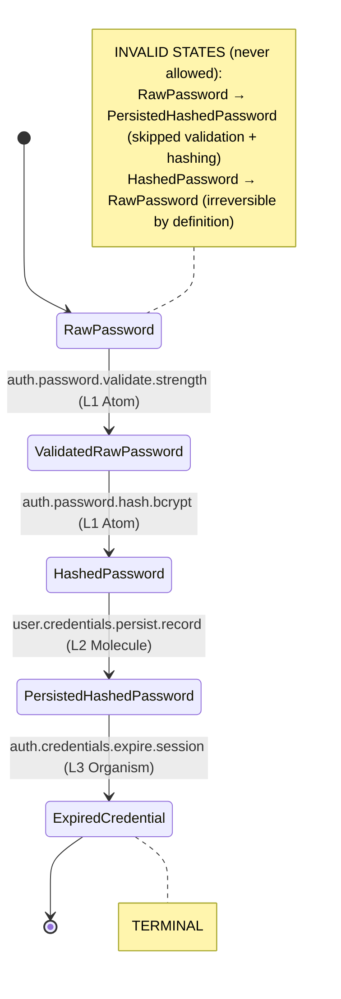
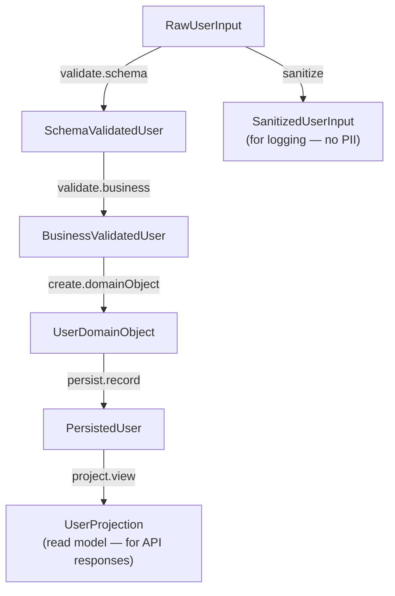

# Type States
### Second Iteration — Encoding data lifecycle in the type itself

---

## The Core Problem: Invisible Data Lifecycle

In traditional code, the same logical concept — say, a "password" — is represented by the same type at every stage of its lifecycle:

```
function register(password: string) {
  const hashed = hash(password)        // password: still string
  store(hashed)                        // hashed: still string
  send_confirmation(password)          // SILENT BUG: sending raw password
}
```

The AI (and the developer) cannot tell from the type which variable holds what. The bug above is invisible to the type system.

Type states solve this by making the lifecycle **explicit in the type**:

```
function register(password: RawPassword) {
  const hashed: HashedPassword = hash(password)
  store(hashed)                        // ✓ only HashedPassword accepted
  send_confirmation(password)          // ✗ TYPE ERROR: RawPassword not accepted
}
```

---

## What Is a Type State?

A type state is a type whose name encodes:
1. **What the data is** (entity)
2. **What has been done to it** (stage/state)
3. **What guarantees it carries** (implicit from the state)

```
{Stage}{Entity}

Stages:
  Raw{Entity}         — unprocessed user input, no guarantees
  Trimmed{Entity}     — whitespace removed, still unvalidated
  Validated{Entity}   — format/constraint validated
  Verified{Entity}    — externally confirmed (e.g., email verified)
  Hashed{Entity}      — one-way transformed
  Encrypted{Entity}   — reversibly transformed
  Persisted{Entity}   — stored in durable storage
  Projected{Entity}   — read-model view of persisted entity
  Serialized{Entity}  — converted to transmission format
  Expired{Entity}     — was valid, now past its valid period
  Revoked{Entity}     — explicitly invalidated
```

---

## Type State Machines

Each domain entity has a **Type State Machine** defined in L0. This machine declares:
- All valid states for the entity
- Legal transitions between states (which ARU performs each)
- Terminal states (no further transitions)
- Invalid states (combinations that must never exist)

### Example: The Password Type State Machine



The state machine is **enforced by the type system**: no ARU can accept `PersistedHashedPassword` as input unless it declares `PersistedHashedPassword` in its manifest. The graph verifies that every transition is performed by a declared ARU.

---

## Example: The User Type State Machine



An AI generating a new user-related ARU immediately knows:
- What state of User data is it working with?
- What ARUs upstream produced that state?
- What ARUs downstream will consume it?

All of this is readable from the type states alone.

---

## Preventing State Violations at the Type Level

The power of type states is that illegal operations become type errors:

| Operation | Without States | With States |
|---|---|---|
| Hash already-hashed password | Silent bug (double hash) | Type error: `HashedPassword` not accepted by `hash()` |
| Persist unvalidated input | Silent bug (dirty data) | Type error: `RawUserInput` not accepted by `persist()` |
| Send raw credentials in email | Security bug | Type error: `RawPassword` not accepted by `email.send()` |
| Return stale projection as live data | Subtle bug | Type error: `CachedProjection` ≠ `LiveProjection` |

Each of these is not just prevented — it's prevented **before the AI writes the code**. The type system rejects the mistake at generation time.

---

## Type State Transitions as ARU Contracts

Every type state transition is performed by exactly one category of ARU:

| Transition | ARU Verb | Layer |
|---|---|---|
| `Raw → Validated` | `validate` | L1 |
| `Raw → Sanitized` | `transform` | L1 |
| `Validated → DomainObject` | `create` | L2 |
| `DomainObject → Persisted` | `persist` (via organism) | L3 |
| `Persisted → Projected` | `project` | L1–L2 |
| `Any → Serialized` | `encode` | L1 |
| `Serialized → Any` | `decode` | L1 |
| `Active → Expired` | `expire` | L3 |
| `Active → Revoked` | `revoke` | L3 |

This table is part of the L0 registry — AI consults it when generating ARUs that work with a specific entity.

---

## Composite Type States

Some states combine multiple entities, each potentially in a different state:

```
type UserRegistrationPayload = {
  user:     BusinessValidatedUser      // validated through business rules
  password: ValidatedRawPassword       // format-validated but not yet hashed
  invite:   ValidatedInviteToken       // invite token verified
}
```

This composite type tells the AI:
- These three things travel together
- Each has been validated to a specific stage
- They are now ready to be passed to a L2 Molecule that will hash the password and create the domain objects

The composite type is the **precondition** of the next ARU, expressed as a product type.

---

## Type State Registry (L0 Artifact)

Every domain entity's type state machine is declared in L0 and included in the Type Registry:

```yaml
type_state_machine:
  entity: "Password"
  domain: "auth"
  
  states:
    - id: "RawPassword"
      guarantees: []
      terminal: false
      
    - id: "ValidatedRawPassword"
      guarantees: ["meets_strength_policy", "non_empty"]
      terminal: false
      
    - id: "HashedPassword"
      guarantees: ["irreversible", "bcrypt_format"]
      terminal: false
      
    - id: "PersistedHashedPassword"
      guarantees: ["in_durable_storage", "indexed_by_user_id"]
      terminal: false
      
    - id: "ExpiredCredential"
      guarantees: ["cannot_authenticate"]
      terminal: true

  transitions:
    - from: "RawPassword"
      to:   "ValidatedRawPassword"
      performed_by: "auth.password.validate.strength"
      
    - from: "ValidatedRawPassword"
      to:   "HashedPassword"
      performed_by: "auth.password.hash.bcrypt"
```

This YAML is machine-readable and loaded by AI as part of the L0 context for the `auth` domain. It provides a complete map of what can happen to a password, in what order, and which ARUs do each step.

---

## AI Navigation Using Type States

When an AI is asked to "add two-factor authentication to the login flow," it:

1. Loads the `auth` domain type state machines
2. Identifies `LoginAttempt` → `AuthenticatedSession` as the relevant pathway
3. Inserts a new state: `PasswordVerifiedLoginAttempt` (between initial and final)
4. Declares the transition ARU: `auth.2fa.verify.totp`
5. Updates the composition graph to insert the new node

All of this is driven by the type state registry. The AI doesn't need to read the existing implementation — it reads the state machine, finds where the new state fits, and generates the ARU with the correct signature.
