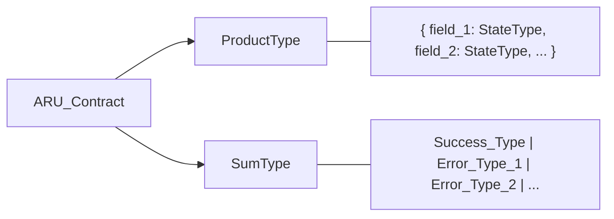

# Algebraic Types
### Second Iteration — Sum types, product types, and the contract grammar

---

## Why Algebra?

Algebra — specifically *type algebra* — gives ARIA a **formal grammar for contracts**. Instead of describing what an ARU does in prose, we express it as a type equation. Type equations are unambiguous, composable, and machine-verifiable.

There are two fundamental type operations:

| Operation | Symbol | Meaning | Also called |
|---|---|---|---|
| Product | `A × B` | "A AND B, both present" | Record, Struct, Tuple |
| Sum | `A \| B` | "Either A OR B, never both" | Union, Either, Variant |

Every ARU contract is built entirely from these two operations applied to branded types and type states.

---

## Product Types — The "AND"

A product type combines multiple fields into one structure. All fields are simultaneously present.

```
UserCredentials = {
  email:    ValidatedEmail        ← must be present AND validated
  password: ValidatedRawPassword  ← must be present AND strength-checked
}
```

This is a product type `ValidatedEmail × ValidatedRawPassword`. Its name `UserCredentials` is a semantic alias.

### Product Type Rules in ARIA

1. **All fields must be branded/state types** — no naked primitives
2. **Field names must match their type semantics** — `email: ValidatedEmail` not `email: string`
3. **No optional fields in input types** — optionality is encoded in Sum types (`FieldValue | Absent`)
4. **Product types represent a moment in time** — all fields are at the same lifecycle stage

### Problematic Product (anti-pattern):
```
INVALID:
UserRegistrationInput = {
  email:     string              ← naked primitive
  password:  string              ← naked primitive, same type as email
  age:       number              ← positive? integer? validated?
}
```

### Valid Product:
```
VALID:
UserRegistrationInput = {
  email:     RawEmailString
  password:  RawPasswordString
  birthDate: RawDateString
  inviteCode: RawInviteCodeString | Absent
}
```

---

## Sum Types — The "OR"

A sum type represents one of several possible values. At any moment, it is exactly one variant — never a mix.

```
AuthResult = ValidatedSession | AuthError
```

### Sum Types for Outputs (the Return Contract)

Every ARU output that can fail is a sum type. The success case and all failure cases are explicitly enumerated:

```
LoginResult =
  | AuthenticatedSession              ← success
  | AuthError.INVALID_CREDENTIALS     ← wrong password
  | AuthError.ACCOUNT_LOCKED          ← too many attempts
  | AuthError.ACCOUNT_NOT_FOUND       ← user doesn't exist
  | AuthError.MFA_REQUIRED            ← needs second factor
```

An AI reading this sum type knows exactly what the caller must handle. There is no "check the docs to see what errors are possible" — the type IS the exhaustive list.

### Sum Types for Optional Fields

Instead of `null` or `undefined`, ARIA uses explicit sum types for absence:

```
INVALID:  profilePicture?: string | null
VALID:    profilePicture: UserProfilePictureUrl | NotProvided
```

`NotProvided` is a named L0 type that semantically means "intentionally absent." It is distinct from `null` (uninitialized) and `undefined` (unknown). The distinction matters for AI reasoning about what to do with missing values.

---

## The Universal ARU Contract Grammar

Every ARU signature is expressible in a single grammar:



Examples:

```
auth.token.validate:
  (TokenString) → ValidatedToken | AuthError.EXPIRED | AuthError.INVALID | AuthError.MALFORMED

user.profile.create:
  (ValidatedProfileData × UserId) → UserProfile | UserError.DUPLICATE | UserError.QUOTA_EXCEEDED

payment.charge.execute:
  (ChargeRequest × PaymentMethod × Amount) → 
    ChargeConfirmation | PaymentError.INSUFFICIENT_FUNDS | PaymentError.CARD_DECLINED | PaymentError.PROVIDER_TIMEOUT
```

The AI reads these like equations. The left side is what it needs. The right side is what it gets. All possibilities are enumerated.

---

## Nested Algebraic Types

Complex data structures are built by nesting products and sums:

```
OrderSummary = {
  id:        OrderId
  customer:  CustomerId
  items:     NonEmptyList<OrderItem>           ← List is a type constructor
  discount:  DiscountAmount | NoDiscount       ← Sum type field
  status:    OrderStatus                       ← State type (Placed | Confirmed | Shipped | ...)
  total:     PositiveMonetaryAmount
}
```

Each field uses the most specific type possible. The nesting can be arbitrarily deep, but every leaf node must be a branded or state type — never a primitive.

---

## Type Constructors (Generic Containers)

ARIA defines a small set of generic container types at L0:

```
NonEmptyList<T>     ← list with at least one element (never empty)
PaginatedList<T>    ← list with cursor, total count, page metadata
Optional<T>         ← T | NotProvided (explicit optionality)
Result<T, E>        ← T | E (the universal return type constructor)
Validated<T>        ← T with proof of validation (wrapper, not alias)
```

These are the only generic containers. An AI uses these and only these — no ad-hoc wrappers.

The most important is `Result<T, E>`:

```
Every ARU output is: Result<SuccessType, ErrorUnion>

Expanded:
  Result<ValidatedToken, AuthError.EXPIRED | AuthError.INVALID>
  ≡
  ValidatedToken | AuthError.EXPIRED | AuthError.INVALID
```

---

## Discriminated Unions (Tagged Sum Types)

When a sum type has many variants, each variant carries a tag to identify it:

```
PaymentStatus =
  | { tag: 'PENDING',   initiatedAt: Timestamp }
  | { tag: 'COMPLETED', completedAt: Timestamp, transactionId: TransactionId }
  | { tag: 'FAILED',    failedAt: Timestamp, reason: PaymentFailureReason }
  | { tag: 'REFUNDED',  refundedAt: Timestamp, refundId: RefundId }
```

The `tag` field makes matching exhaustive and unambiguous. An AI handling a `PaymentStatus` value knows from the tag which fields are available — no runtime guessing, no "check if field exists."

---

## Algebraic Types and the Semantic Graph

In the Semantic Graph, type compatibility between ARUs is determined algebraically:

### PIPE Compatibility
ARU A can be piped to ARU B if:
```
A.output_success_type ≤ B.input_type  (A's output is subtype of B's input)
```

If A's output is `ValidatedEmail` and B expects `ValidatedEmail`, compatible.
If A's output is `RawEmail` and B expects `ValidatedEmail`, incompatible — needs a VALIDATE step between them.

### ROUTE Compatibility
```
predicate(A.output) → B.input  OR  C.input
type_check: A.output must be assignable to both B.input and C.input
```

### JOIN Compatibility
```
[A.output, B.output] must structurally match C.input product type
```

The graph's type-checker runs these algebraic compatibility checks at build time, making type errors in compositions impossible to overlook.

---

## Exhaustiveness as a Build Constraint

When an ARU's output is a sum type, every consumer in the graph must handle **all variants**:

```
LoginResult = AuthenticatedSession | AuthError.INVALID | AuthError.LOCKED | AuthError.MFA_REQUIRED

If a downstream ARU only handles:
  AuthenticatedSession | AuthError.INVALID

→ BUILD FAILURE: AuthError.LOCKED and AuthError.MFA_REQUIRED are unhandled
```

This exhaustiveness check runs at graph build time. No AI-generated code reaches runtime with unhandled error cases.

---

## Type Algebra as Communication Protocol

When two AI agents collaborate on a system — one building the producer ARU, one building the consumer ARU — their **shared contract is a type equation**:

```
Contract between Agent A (produces) and Agent B (consumes):

  Agent A agrees to produce: Result<OrderConfirmation, OrderError.OUT_OF_STOCK | OrderError.PAYMENT_FAILED>
  Agent B agrees to consume: OrderConfirmation | OrderError.OUT_OF_STOCK | OrderError.PAYMENT_FAILED

Both agents can work independently, in parallel, without reading each other's code.
The type equation is the entire interface specification.
```

This is how ARIA enables **parallel AI development** at scale: agents share type contracts, not implementations.
