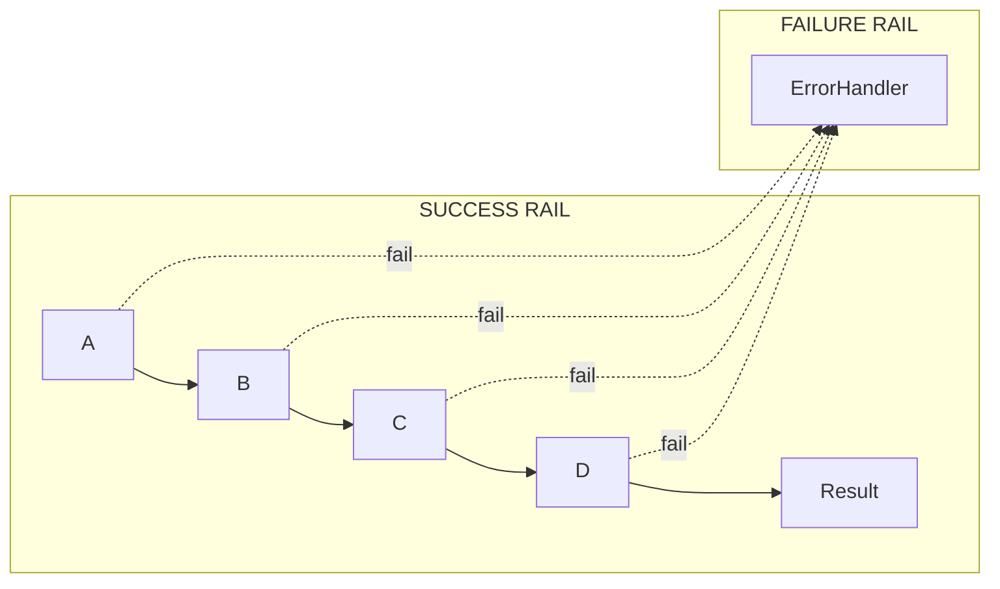
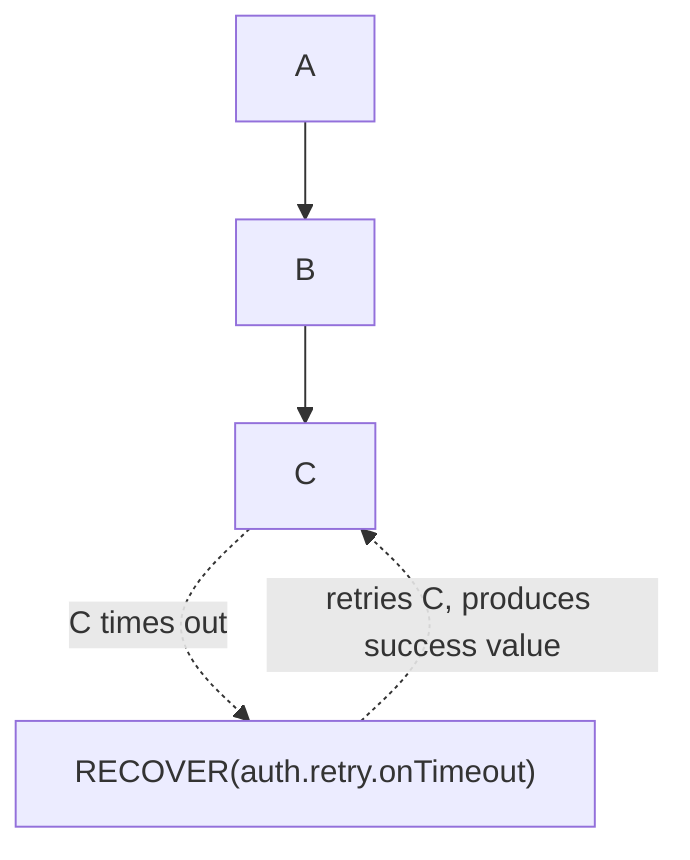
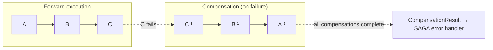
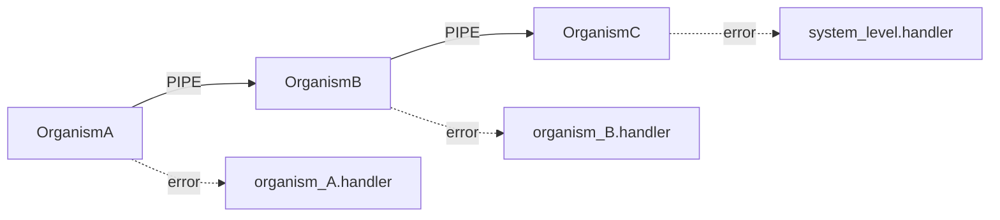

# Error Propagation — Railway-Oriented Model
### Third Iteration — Formal failure semantics for all compositions

---

## Influence: Railway-Oriented Programming

The error model in this document is a formalization of **Railway-Oriented Programming**, a pattern described by Scott Wlaschin at [fsharpforfun.com/posts/recipe-part2](https://fsharpforfun.com/posts/recipe-part2). The core metaphor — a two-track railway where success travels on one rail and failure on the other, with functions that switch tracks but never silently discard errors — maps directly onto ARIA's `Result<T, E>` propagation model. ARIA extends it by specifying the failure semantics for all 22 composition patterns and by making error handling a manifest-declared concern rather than an implementation convention.

---

## The Gap (Resolved)

The original gap: `03-composition-patterns.md` defined what happens when everything succeeds, but was silent on failure. This document formally resolves that gap with the railway-oriented model below. The failure semantics for all 22 composition patterns are now fully specified — see the **Complete Pattern Failure Semantics Reference** table at the end of this document.

The problem this solves: in a `PIPE` chain of five ARUs, if ARU #3 returns an error, do ARUs #4 and #5 execute? Who catches the error? Where is it handled?

Without a formal answer, every AI generating a composition makes a different choice. The result is inconsistent error handling across the codebase — the exact kind of ambiguity ARIA exists to eliminate.

---

## The Railway Model

ARIA adopts **railway-oriented programming** as its formal error propagation model. The metaphor is precise:



Every ARU in a PIPE chain has two output tracks:
- **Success rail**: the normal output flows to the next ARU
- **Failure rail**: any error bypasses all remaining ARUs and flows directly to a declared error handler

No ARU in the middle of a chain ever receives an error as input. Each ARU only ever sees valid, typed, success-path data.

---

## Formal Definition

### The Two-Track Type

Every ARU in a PIPE chain implicitly operates on a **two-track type**:

```
TwoTrack<T, E> =
  | { track: 'SUCCESS', value: T }
  | { track: 'FAILURE', error: E }
```

This is identical to `Result<T, E>` from `10-algebraic-types.md`. The railway model IS the `Result` type made architectural.

An ARU that is `validate` or `transform` switches between tracks:
- **Track switch (success → failure)**: ARU returns an Error — the value leaves the success rail
- **Track switch (failure → success)**: A `RECOVER` operation (see below) — the error is handled and flow resumes

### Implicit vs. Explicit Railway

ARUs don't need to know they're in a railway. Their contract is:

```
input:  T           (always a success-path value — never receives an error)
output: T' | Error  (may succeed or fail)
```

The composition system (not the ARU) is responsible for routing errors to the failure rail. The ARU is unaware of its position in the chain.

---

## Railway Composition Rules

### Rule 1: PIPE short-circuits on failure

```
A → B → C → D

If B returns Error:
  ✓ Error goes to failure rail immediately
  ✗ C and D are NOT called
  ✓ Failure rail delivers Error to the chain's ErrorHandler
```

### Rule 2: Every PIPE composition declares an ErrorHandler

No PIPE chain is architecturally complete without a declared error handler. The handler is an ARU:

```yaml
composition:
  pattern: PIPE
  chain: [auth.token.validate, auth.session.create, user.profile.load]
  error_handler: auth.pipeline.handleError   ← required, not optional
```

An undeclared error handler is a **build failure**. There is no such thing as "errors are the caller's problem" — the caller IS the composition, and the composition must declare its handler.

### Rule 3: Error types accumulate through the chain

The failure rail carries a union of all possible error types from all ARUs in the chain:

```
Chain: [A: X→Y | ErrA] → [B: Y→Z | ErrB] → [C: Z→W | ErrC]
Failure rail type: ErrA | ErrB | ErrC
ErrorHandler input: ErrA | ErrB | ErrC
```

The error handler must be exhaustive — it must handle all variants. Unhandled error variants are a build failure (same exhaustiveness rule as in `10-algebraic-types.md`).

### Rule 4: Errors carry provenance

Every error on the failure rail is wrapped with provenance metadata:

```
RailError<E> = {
  error:      E                    ← the original typed error
  origin_aru: ARU_id               ← which ARU produced it
  trace_id:   CorrelationId        ← from the observability system
  timestamp:  ISO8601Timestamp
}
```

The AI generating an error handler receives a `RailError<ErrA | ErrB | ErrC>` — it always knows where the error came from without inspecting the error payload.

---

## The RECOVER Operation

A `RECOVER` operation switches from the failure rail back to the success rail. It is a special ARU:

```
RECOVER: RailError<E> → T | FatalError
```

It takes an error and either:
- Produces a valid success-path value (error is handled, flow continues)
- Produces a `FatalError` (error cannot be recovered, propagates up)



### RECOVER placement rules

RECOVER can only be placed:
1. At the end of a chain (terminal handler)
2. Immediately after the ARU it is recovering from (inline recovery)

It cannot appear in the middle of a chain recovering from an upstream ARU — that would create invisible control flow that is impossible for AI to reason about.

---

## Pattern-Specific Railway Semantics

Each composition pattern has defined failure semantics:

### FORK on failure
```
If A fails:        failure rail fires before any fork target is called
If B fails:        failure rail fires; C may or may not have been called
                   (non-deterministic — FORK targets are independent)
```
FORK targets that have been called are NOT automatically rolled back. If rollback is needed, use SAGA (see `03-composition-patterns.md §SAGA`).

### JOIN on failure
```
If A fails:        failure rail fires; B is NOT called (short-circuit)
If B fails:        A has already completed; failure rail fires
                   A's result is discarded (no rollback unless SAGA)
```

### LOOP on failure
```
Failure inside loop body:   failure rail fires; loop exits immediately
                             (no retry — use RECOVER inside the loop body for retry logic)
```

### GATE on failure (input ARU fails)
```
If the GATE predicate ARU fails:   failure rail fires
If A fails upstream of GATE:       failure rail fires before GATE is evaluated
```

### ROUTE on failure
```
If the routing predicate ARU fails:
  → failure rail fires immediately
  → neither B nor C is called
  → RailError includes origin_aru: predicate ARU id (not the upstream ARU)

If A fails before reaching the predicate:
  → failure rail fires before predicate evaluation

Note: ROUTE predicate failure is distinct from the predicate returning false.
  returning false = valid routing decision (go to branch C)
  returning Error  = predicate ARU itself is broken (failure rail, both branches skipped)
```

Predicate ARUs used in ROUTE and GATE must declare `error_variants: []` in their manifest
if they are designed to be total (never fail). Any non-empty `error_variants` declaration
signals the caller composition that a failure rail case must be handled.

### VALIDATE on failure
```
VALIDATE output: success_type | ValidationError

The two tracks are explicit in the return type — not hidden.
On success: output is the narrowed type (subtype of input), continues on success rail
On failure: ValidationError goes to failure rail

VALIDATE does NOT short-circuit the whole pipeline on failure by default.
The composition may declare a policy:
  fail_policy: CONTINUE   # drop the item, continue (used in batch processing)
  fail_policy: SHORT_CIRCUIT  # default — treat as pipeline failure
```

### TRANSFORM on failure
```
TRANSFORM is declared deterministic with no side effects.
In practice, TRANSFORM can fail (malformed input, codec error).

If TRANSFORM fails:
  → failure rail fires
  → RailError.origin_aru identifies the transform
  → The failure type is TransformError (declared in manifest error_variants)

A TRANSFORM with no declared error_variants is guaranteed total — build-time enforcement.
```

### OBSERVE on failure
```
OBSERVE emits an event to an EventBus as a side channel.
The main data flow must NEVER be affected by observation failure.

Rule: OBSERVE failure is isolated — it CANNOT propagate to the failure rail.
If the event emission fails:
  → Log the failure internally (dead-letter queue or silently discard per backpressure policy)
  → Main data flow continues on SUCCESS rail as if OBSERVE succeeded

This is the only pattern where failure is intentionally swallowed.
OBSERVE is declared as non-critical by definition — if observation failing is critical,
use a PIPE to an explicit event-processing ARU instead.
```

### CACHE on failure
```
Cache HIT:  returns stored value → no failure possible (value was validated when stored)
Cache MISS: executes the underlying ARU

If the underlying ARU fails on CACHE MISS:
  → failure rail fires (same as direct ARU failure)
  → value is NOT stored in the cache

If the cache storage itself fails (write-back error):
  → The underlying ARU's SUCCESS result is returned (cache write is best-effort)
  → A OBSERVE-pattern event is emitted: CacheWriteError
  → Main flow continues on SUCCESS rail

Cache read failure (storage unavailable):
  → Treat as cache MISS → execute underlying ARU
  → OBSERVE event: CacheReadError
  → Must be declared in CACHE ARU manifest: `read_failure_policy: FALLTHROUGH | FAIL`
```

---

## The Three-Track Type (PARALLEL_JOIN Extension)

The binary two-track model (SUCCESS | FAILURE) is insufficient for `PARALLEL_JOIN` with
`minimum_required_results` semantics. A third track is introduced:

```
ThreeTrack<T, P, E> =
  | { track: 'SUCCESS',        value: T }
  | { track: 'PARTIAL_SUCCESS', value: P, failures: RailError<E>[] }
  | { track: 'FAILURE',        error: E }
```

### PARALLEL_JOIN on failure
```
Inputs: branches [B1, B2, B3, ..., Bn]
Configuration:
  minimum_required_results: k   (k <= n)
  timeout: duration

Case 1 — All branches succeed:
  → SUCCESS track with complete merged product type

Case 2 — k or more branches succeed (within timeout):
  → PARTIAL_SUCCESS track
  → value: product type with results from succeeding branches
           (missing branches represented as declared absent fields)
  → failures: list of RailError from failed branches

Case 3 — Fewer than k branches succeed (or timeout exceeded):
  → FAILURE track
  → error: ParallelJoinError { succeeded: n, required: k, failures: RailError[] }

The composition consuming PARALLEL_JOIN MUST handle all three tracks.
A handler that only handles SUCCESS and FAILURE is a build failure.
```

**Manifest declaration for PARALLEL_JOIN:**
```yaml
composition:
  pattern: PARALLEL_JOIN
  branches: [...]
  minimum_required_results: 2
  timeout_ms: 5000
  partial_success_handler: domain.parallel.handlePartial   ← required when min < total branches
  error_handler: domain.parallel.handleFailure
```

---

## SAGA Compensation Protocol

SAGA is the only pattern where the **failure rail triggers active compensating work** rather than
passive error delivery.

### The Compensation Sub-Protocol



On failure at step X (e.g., C fails):
  1. C's failure goes to SAGA's internal failure rail (not the chain's error handler)
  2. SAGA coordinator calls C⁻¹ (C's compensating ARU) — even though C failed,
     C may have produced partial side effects that need reversal
  3. If C⁻¹ succeeds: call B⁻¹ → A⁻¹ in strict reverse order
  4. When all compensations complete: deliver CompensationResult to the SAGA error handler

On failure at compensation (C⁻¹ fails):
  5. Log CompensationFailure with full provenance
  6. Continue reverse compensation (B⁻¹, A⁻¹) — do not abort compensation on compensation failure
  7. Deliver PartialCompensationResult to error handler:
     { compensated: [B, A], failed_compensation: [C], original_failure: RailError }
```

### Who Calls the Compensating ARUs

The **SAGA composition ARU** is the coordinator. It is not a passive connection — it is an active
ARU that:
- Tracks the execution state of all forward steps
- Knows which steps have executed (and thus need compensation)
- Dispatches compensation in reverse order
- Delivers the final outcome to the error handler

```yaml
# SAGA composition manifest
composition:
  pattern: SAGA
  steps:
    - aru: billing.charge.execute.payment
      compensating_aru: billing.charge.compensate.reverse
    - aru: inventory.stock.execute.reserve
      compensating_aru: inventory.stock.compensate.release
    - aru: fulfillment.order.execute.create
      compensating_aru: fulfillment.order.compensate.cancel
  error_handler: billing.saga.handleCompensationResult
```

### Compensation ARU Requirements
```
compensation_aru:
  - Must be idempotent (may be called more than once in retry scenarios)
  - Input type: the same type as the forward ARU's input (plus a compensation_context field)
  - Output type: CompensationResult | CompensationFailure
  - Must NEVER call downstream ARUs (compensation is always purely local to its own step)
  - Declared side_effects: WRITE (compensation IS a side effect by definition)
```

### SAGA and the Binary Railway

SAGA does not use the binary railway model internally — the three possible outcomes are:
```
SAGAResult<T> =
  | { outcome: 'COMMITTED',    value: T }
  | { outcome: 'COMPENSATED',  compensation_log: CompensationLog }
  | { outcome: 'PARTIAL',      compensation_log: CompensationLog, uncompensated: ARU_id[] }
```

COMMITTED maps to the SUCCESS track. COMPENSATED and PARTIAL map to the FAILURE track at the
outer composition level. The SAGA error handler receives a typed SAGAResult, not a raw RailError.

---

## Distributed Pattern Failure Semantics

### STREAM on failure

STREAM introduces two failure granularities — **element-level** and **stream-level**:

```
Element-level failure (one element fails to process):
  element_failure_policy:
    DROP:        Discard the element, continue the stream (lossy, explicit declaration required)
    DEAD_LETTER: Route the element to a declared dead-letter ARU, continue the stream
    FAIL_STREAM: Treat as stream-level failure (default)

Stream-level failure (source or sink unavailable):
  → Stream-level failure rail fires
  → All in-flight elements are either:
      a) completed (if processing is idempotent) or
      b) dead-lettered (if not)
  → RailError<StreamError> delivered to stream error handler
```

**Manifest declaration:**
```yaml
behavioral_contract:
  backpressure: BUFFER(1000)
  element_failure_policy: DEAD_LETTER
  dead_letter_aru: "stream.deadletter.handle.element"
  stream_error_handler: "stream.error.handle.streamFailure"
```

### CIRCUIT_BREAKER on failure

CIRCUIT_BREAKER adds a **typed circuit state** as a first-class error variant:

```
CircuitBreakerError =
  | { type: 'CIRCUIT_OPEN', state: CircuitState, retry_after: ISO8601Timestamp }
  | { type: 'EXECUTION_FAILURE', underlying_error: RailError<E> }

When circuit is OPEN:
  → Calls fail IMMEDIATELY with CircuitBreakerError.CIRCUIT_OPEN
  → Underlying ARU is NOT called
  → retry_after is computed from the circuit's configuration

When circuit is HALF_OPEN and probe fails:
  → Circuit returns to OPEN
  → CircuitBreakerError.CIRCUIT_OPEN delivered to failure rail

When circuit is HALF_OPEN and probe succeeds:
  → Circuit transitions to CLOSED
  → That call's result delivered to SUCCESS rail
```

Callers of a CIRCUIT_BREAKER-wrapped ARU must handle `CircuitBreakerError.CIRCUIT_OPEN` as a
distinct error variant. Treating it as a generic failure is a build warning (it loses the
`retry_after` information that enables intelligent backoff).

---

## Complete Pattern Failure Semantics Reference

| Pattern | Success Rail | Failure Rail | Special Cases |
|---|---|---|---|
| PIPE | Passes to next ARU | Short-circuit to ErrorHandler | — |
| FORK | All branches get value | Pre-fork failure only | Branch failures are independent |
| JOIN | Merged product to C | Any branch failure before merge | A completes even if B fails |
| GATE | Passes if predicate true | Predicate ARU failure | False predicate = drop (not failure) |
| ROUTE | Dispatches to one branch | Predicate ARU failure | False/true = routing decisions (not failures) |
| VALIDATE | Narrowed type | ValidationError | Configurable: SHORT_CIRCUIT or CONTINUE |
| LOOP | Exits when condition met | Body failure exits loop | Use RECOVER inside for retry |
| OBSERVE | Main flow unchanged | **Isolated — never propagates** | OBSERVE failures are swallowed |
| TRANSFORM | Converted type | TransformError | Total transforms declare no error_variants |
| CACHE | Hit returns stored; miss executes | Miss: underlying failure | Read/write failures have separate policies |
| STREAM | Elements processed | Element or stream-level failure | Two granularities: element vs. stream |
| SAGA | COMMITTED | COMPENSATED or PARTIAL | Compensation runs on failure rail |
| CIRCUIT_BREAKER | Result delivered | CIRCUIT_OPEN or EXECUTION_FAILURE | OPEN = fast-fail, not underlying error |
| PARALLEL_JOIN | Complete product | Fewer than minimum succeed | PARTIAL_SUCCESS track for partial results |
| PARALLEL_FORK | All branches get value | Pre-fork failure only | Each branch has independent failure rail |
| SCATTER_GATHER | Aggregated results | Worker or aggregator ARU failure | Partial results possible with timeout |
| COMPENSATING_TRANSACTION | Forward ARU output | Forward fails → compensation runs | Compensation failure = UNRECOVERABLE error |
| STREAMING_PIPELINE | Processed chunk stream | Chunk processor failure | Configurable: stop vs. skip-bad-chunk |
| CACHE_ASIDE | Cache hit or loaded value | Load failure on miss | TTL expiry is not failure — triggers reload |
| BULKHEAD | Result from target ARU | Pool exhausted → QUEUE_OVERFLOW error | Timeout waiting in queue is also an error |
| PRIORITY_QUEUE | Result from target ARU | Target failure or queue overflow | High-priority items never dropped silently |
| EVENT_SOURCING | Projected aggregate | Projection failure | Event append is always success-rail | and Error Propagation

When a composition is nested inside another (a PIPE chain inside an ORGANISM inside a SYSTEM), failure rails compose:



Each layer handles the errors it can recover from locally. Errors that cannot be recovered are **escalated** up the railway to the next layer's handler.

The escalation path is:
```
Atom-level error → Molecule handler (if declared)
                 → Organism handler (if not handled at molecule)
                 → System handler  (if not handled at organism)
                 → Domain handler  (if not handled at system)
                 → UNHANDLED (hard build failure — every error must be handled somewhere)
```

---

## What AI Must Generate for Every PIPE Composition

With the railway model defined, the AI's code generation task for a PIPE composition is fully specified:

1. **Chain** — the sequence of ARU calls on the success rail
2. **Error union** — the union of all error types across the chain
3. **Error handler** — an ARU that exhaustively handles the error union
4. **RECOVER points** (if any) — inline recovery for specific, known-recoverable errors
5. **Provenance wrapping** — `RailError<E>` wrapping at each failure point

No free-form error handling. No try/catch scattered through the code. No silent swallowing. The railway model makes the shape of every composition's error handling as predictable as the shape of its success path.
