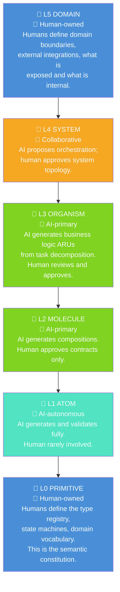
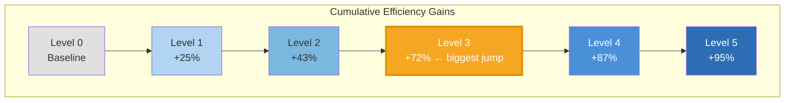

# Human-AI Collaboration Model and Compliance Levels
### Third Iteration — Who owns what, and how to adopt ARIA incrementally

---

## The Framing Correction

The original ARIA framing stated: *"AI is the consumer — not humans. Optimize for token efficiency, not readability."*

This is aspirationally correct but practically misleading. An honest statement of the model is:

> **Humans define the vocabulary and the boundaries. AI fills in the implementation.**

The architecture is AI-optimized, but it is not AI-autonomous. Humans make two categories of decisions that AI cannot:
1. **What things mean** — the semantics of domain types, the boundaries of domains
2. **What is acceptable** — approving contracts as STABLE, declaring sunset dates, resolving business conflicts

Everything else — creating ARUs, composing patterns, generating implementations, writing tests, refactoring graphs — is AI work. This is not a limitation; it is a feature. The human contribution is concentrated at the highest-leverage points and minimized everywhere else.

---

## Layer Ownership Map



### Why L0 is Human-Owned

L0 is the **semantic constitution** of the system. It answers: *what are the fundamental concepts of this domain, what states can they be in, and what constraints apply?*

These are not engineering decisions — they are domain decisions. `HashedPassword` is not just a type; it is a commitment that passwords are always hashed before storage. `ValidatedEmail` is not just a type; it is a business rule that emails must be validated before use.

AI can suggest L0 types. AI cannot decide what the business domain means.

### Why L5 is Human-Owned

L5 defines what is **internal** vs **external**, and what the system promises to the outside world. These are strategic decisions with contractual and security implications. An AI deciding what API surface to expose, or which third-party system to integrate with, is making business decisions it is not equipped to make.

AI can implement L5 ARUs from a human-declared specification. AI cannot declare the specification.

---

## The Human Touchpoints

Human involvement is concentrated at specific, high-leverage moments:

| Touchpoint | When | Human Decision |
|---|---|---|
| L0 bootstrap | Once per domain | Define type vocabulary and state machines |
| L5 design | Per major feature | Define domain boundaries and external contracts |
| Contract promotion | Per new ARU | Approve CANDIDATE → STABLE transition |
| Deprecation | Per breaking change | Initiate STABLE → DEPRECATED, set sunset date |
| Task assignment | Per iteration | Decompose high-level goals into task trees |
| Architecture review | Periodically | Review PAS score, consistency trends, graph health |

Everything else is AI. In a mature ARIA codebase, **human involvement is measured in minutes per feature**, not days.

---

## ARIA Compliance Levels

ARIA is not all-or-nothing. It is a gradient, and each level delivers measurable improvements to AI efficiency independently.

### Level 0 — Unconstrained
Standard codebase. No ARIA conventions. AI efficiency: baseline.
- No named types beyond primitives
- No layer declarations
- No manifests
- AI must read full implementations to understand anything

### Level 1 — Named Types
Branded types and type states are used throughout. No other ARIA structure.
- AI can read signatures and understand what data is without reading implementations
- Estimated efficiency gain: **20–30%** reduction in context needed for understanding existing code
- Adoption cost: low — just rename types systematically

### Level 2 — Layer Declarations
All code is organized into layers (L0–L5). Layer boundaries are enforced.
- AI understands *where* each piece lives and what it's allowed to depend on
- Enables AI to reason about impact radius of changes without reading implementations
- Estimated efficiency gain: additional **15–20%**
- Adoption cost: medium — requires reorganizing existing code

### Level 3 — Manifests
All ARUs have machine-readable manifests (even if manually written initially).
- AI can navigate the codebase using progressive disclosure
- Context budgets become calculable
- Estimated efficiency gain: additional **25–35%** (largest single jump)
- Adoption cost: medium-high — manifests must be written and maintained

### Level 4 — Semantic Graph
The full codebase is represented as a queryable DAG.
- AI uses graph queries instead of file-tree searches
- Minimum subgraph calculation is available
- Multi-agent work becomes coordinated
- Estimated efficiency gain: additional **15–20%**
- Adoption cost: high — requires graph build tooling

### Level 5 — Full ARIA
Type compatibility checking, railway error propagation, contract versioning, task decomposition grammar.
- AI operates with maximum precision and minimum context
- Context cost approaches sublinear growth with codebase size
- Estimated efficiency gain: additional **10–15%** (diminishing returns — the earlier levels do the heavy lifting)
- Adoption cost: highest — requires full toolchain

### Cumulative Efficiency Gains



*(Estimates relative to unstructured baseline; actual gains vary by codebase and task type)*

---

## The Incremental Migration Path

A codebase migrates through levels in order. Skipping levels is possible but not recommended — each level builds the vocabulary that makes the next level tractable.

### Level 0 → 1 Migration
Tool: a type analysis agent that identifies all primitive parameters that carry semantic meaning and proposes branded type replacements.

Human involvement: approve the proposed type vocabulary (L0 decisions).

### Level 1 → 2 Migration
Tool: a layer assignment agent that analyzes dependency graphs and proposes layer assignments.

Human involvement: resolve ambiguities at L3/L4 boundary (business logic vs. orchestration).

### Level 2 → 3 Migration
Tool: a manifest generation agent that drafts manifests from types and tests.

Human involvement: annotate purpose, stability, and test scenarios that cannot be derived automatically.

### Level 3 → 4 Migration
Tool: graph build tooling that generates the DAG from manifest declarations.

Human involvement: minimal — mostly automated if manifests are complete.

### Level 4 → 5 Migration
Tool: type compatibility checker, railway composition validator, contract versioning system.

Human involvement: architectural decisions about error handling strategies and domain boundary contracts.

---

## The Bootstrapping Protocol

The most common question: *"We have a 200k-line codebase. Where do we start?"*

```
Step 1:  Run the type analysis agent on the existing codebase
         → Get a proposed L0 type vocabulary
         → Human reviews and approves: ~2–4 hours of domain expert time

Step 2:  Apply branded types systematically (automated)
         → Fix type errors introduced by branding: ~1–2 days of AI work

Step 3:  Layer assignment (mostly automated)
         → Human resolves ~10–20% of ambiguous cases

Step 4:  Manifest generation for the most-used ARUs first (Pareto principle)
         → 20% of ARUs are involved in 80% of AI tasks
         → Manifest those 20% first; gain most of the Level 3 benefit immediately

At this point: significant AI efficiency gains with <2 weeks of adoption investment.
Remaining levels can follow incrementally as the team builds familiarity.
```

---

## The PAS Score as Adoption Metric

From `07-consistency-amplification.md`, the Prediction Accuracy Score (PAS) measures AI-readability. In the compliance level model:

| Level | Expected PAS Range |
|---|---|
| 0 | 20–40% |
| 1 | 40–55% |
| 2 | 55–70% |
| 3 | 70–85% |
| 4 | 85–92% |
| 5 | 92–98% |

PAS is the **business metric** for ARIA adoption. Teams can measure it, track it over time, and correlate it with AI task quality and error rates. It makes "AI-readability" a concrete, measurable property rather than a vague architectural goal.
