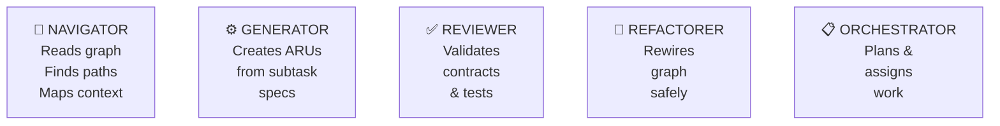
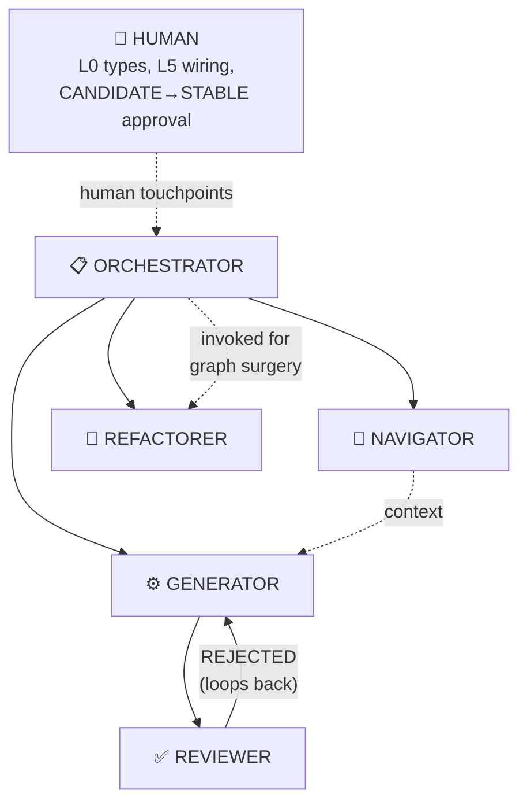

# AI Agent Roles
### Fourth Iteration — Specialized agents with defined context strategies

---

## Overview

ARIA does not assume a single general-purpose AI that does everything. Different tasks require fundamentally different context loading strategies, graph access patterns, and output contracts. Mixing these into one agent produces an agent that does everything poorly.

ARIA defines **five specialized agent roles**. Each role is itself an ARU at the meta-level — it has a typed input, a typed output, a declared layer of operation, and a defined context loading protocol.



---

## Role 1: Navigator

**Purpose:** Query the Semantic Graph to answer structural questions and compute minimum context loads. The Navigator is read-only — it never writes code or manifests.

**Input:** A navigation query (capability search, impact radius, minimum subgraph, neighbor discovery)
**Output:** A structured navigation result (ordered ARU list with context levels)

### Context Loading Strategy
```
Loads on init:  Full graph index (~500 tokens)
Per query:      Manifest signatures (Level 1, ~50 tokens/ARU) only
Never loads:    ARU implementations
```

### Graph Access
- **Read:** Entire graph index, manifest signatures
- **Write:** Nothing — read-only agent

### Core Operations

| Operation | Input | Output |
|---|---|---|
| `find_capability(description)` | Natural language | Ranked ARU list + similarity scores |
| `minimum_subgraph(aru, task_type)` | ARU id + task type | Ordered read list with context levels |
| `impact_radius(aru)` | ARU id | All upstream dependents + risk level |
| `composition_suggest(a, b)` | Two ARU ids | Compatible patterns based on type signatures |
| `layer_neighbors(aru)` | ARU id | ARUs in same layer + domain |
| `path_exists(from, to)` | Two ARU ids | Boolean + path if found |

### When Navigator is Called
- At the **start of every task**, before any other agent acts
- By the Orchestrator during decomposition to verify capability gaps
- By the Generator to find existing ARUs to compose with
- By the Reviewer to find the impact radius of a proposed change

---

## Role 2: Generator

**Purpose:** Create new ARUs from typed subtask specifications. The Generator never invents scope — it implements exactly what the decomposition grammar specifies.

**Input:** A `subtask` object (from task decomposition, type `ARU_CREATION` or `TYPE_ADDITION`)
**Output:** Implementation code + manifest in DRAFT state

### Context Loading Strategy
```
Loads on init:      Navigator result (minimum subgraph for the subtask)
Contract level:     Level 2 (contract) for all dependencies
Behavior level:     Level 3 (behavior) for one reference ARU at the same layer
Implementation:     Level 4 only for the reference ARU — used as structural template
Never loads:        Implementation of unrelated ARUs
```

### Graph Access
- **Read:** Manifest signatures of neighbors; contracts of direct dependencies
- **Write:** New ARU file + manifest (status: DRAFT)

### Generation Protocol

```
Step 1:  Receive subtask spec (types declared, layer declared, composition declared)
Step 2:  Call Navigator.layer_neighbors() → find structural template to follow
Step 3:  Load template at Level 4 (implementation) → extract structural pattern
Step 4:  Load all dependency ARUs at Level 2 (contract only)
Step 5:  Load L0 type registry entries for input/output types
Step 6:  Draft manifest (Tier 1 auto-derived, Tier 2 proposed)
Step 7:  Generate implementation to satisfy contract + test scenarios
Step 8:  Verify implementation compiles and type-checks
Step 9:  Submit ARU (DRAFT) to Reviewer
```

### What Generator Does NOT Do
- Decide what types to create (that is L0, human-owned)
- Choose the layer (declared in subtask)
- Design the composition (declared in subtask)
- Approve its own work (that is Reviewer)
- Handle ambiguous requirements — emits `SUBTASK_UNDERSPECIFIED` and returns to Orchestrator

---

## Role 3: Reviewer

**Purpose:** Validate that a generated or modified ARU correctly implements its declared contract. The Reviewer is the quality gate — nothing moves from DRAFT to CANDIDATE without Reviewer approval.

**Input:** An ARU in DRAFT state + its manifest
**Output:** `APPROVED` (manifest updated to CANDIDATE) or `REJECTED` (structured feedback to Generator)

### Context Loading Strategy
```
Loads on init:      The ARU under review at Level 4 (full implementation)
Loads per check:    Level 2 contracts of all declared dependencies
Never loads:        Unrelated ARUs; the full graph
```

### Graph Access
- **Read:** The ARU under review; dependency contracts; type registry
- **Write:** Manifest status field only (DRAFT → CANDIDATE or adds rejection notes)

### Review Checklist

The Reviewer runs these checks in order, failing fast on the first critical issue:

```
1. CONTRACT ACCURACY
   □ Input type matches declaration
   □ Output success type matches declaration  
   □ All declared error variants are actually producible
   □ No undeclared error variants are thrown/returned
   □ Side effects match declaration (no hidden I/O)

2. TYPE SAFETY
   □ No naked primitives used internally where branded types should be
   □ Type state transitions are legal per the state machine
   □ No type widening except at declared TRANSFORM points

3. RAILWAY COMPLIANCE
   □ All errors are returned as typed values (no exceptions/throws)
   □ If part of a PIPE chain, error handler is declared
   □ Error types match declared output union

4. BEHAVIORAL CONTRACT
   □ No calls to dependencies that exceed declared rate limits
   □ Retry logic (if any) respects retryable_errors list
   □ Idempotency guarantee holds if declared

5. LAYER COMPLIANCE
   □ No dependencies on layers above declared layer
   □ Layer-skip dependencies are documented in manifest
   □ No circular dependencies introduced

6. TEST CONTRACT COVERAGE
   □ All declared test scenarios have a corresponding test
   □ Each test validates postconditions, not just return values
   □ Error scenarios are tested (not just happy path)
```

### Rejection Format

```yaml
review_rejection:
  aru_id: "auth.token.validate"
  reviewer_run_id: "rev-2026-03-12-001"
  critical_failures:
    - check: "CONTRACT_ACCURACY"
      finding: "AuthError.NETWORK_TIMEOUT is returned but not declared in output type"
      location: "line 47"
      fix: "Add AuthError.NETWORK_TIMEOUT to output union OR remove the throw"
  warnings:
    - check: "TEST_CONTRACT_COVERAGE"
      finding: "Scenario 'non-JWT string returns MALFORMED' has no test"
      fix: "Add test for malformed input case"
  approved: false
```

The structured rejection is sent back to the Generator, which makes targeted fixes and resubmits.

---

## Role 4: Refactorer

**Purpose:** Restructure the Semantic Graph without breaking external contracts. The Refactorer performs graph surgery — it changes how ARUs are connected, extracted, or combined without changing their observable behavior.

**Input:** A refactor operation spec (type: `GRAPH_REWIRE`, `ARU_VERSION`, `MIGRATION_CREATION`)
**Output:** Modified graph + updated manifests

### Context Loading Strategy
```
Loads on init:    Impact radius of all target ARUs
Contract level:   Level 2 for all ARUs in the impact radius
Behavior level:   Level 3 for ARUs being structurally changed
Implementation:   Level 4 only for ARUs being directly modified
```

### Graph Access
- **Read:** Full subgraph of impact radius
- **Write:** ARU implementations, manifests, graph edges

### Core Refactor Operations

| Operation | Description | Safety Check |
|---|---|---|
| `extract_molecule(atoms[])` | Pull repeated atom composition into a named molecule | Verify all callers still type-check |
| `inline_aru(aru)` | Dissolve an ARU into its callers | Verify behavior is preserved |
| `split_aru(aru)` | Separate two responsibilities into two ARUs | Verify combined behavior matches original |
| `rewire_chain(old, new)` | Replace one ARU in a chain with another | Type compatibility check |
| `introduce_migration(v1, v2)` | Insert a migration ARU between versions | Verify bridge types are correct |

### The Refactorer's Prime Directive

> **No refactor is safe if it changes the observable contract of any STABLE ARU.**

The Refactorer always runs a pre-check: does this operation affect the input/output type, side effects, or error variants of any STABLE ARU? If yes, it is not a refactor — it is a versioning operation (`ARU_VERSION` subtask), which requires a new version, a migration ARU, and human approval to deprecate the old one.

---

## Role 5: Orchestrator

**Purpose:** Receive a high-level Task, decompose it into a typed subtask DAG, and coordinate execution across the other four roles. The Orchestrator is the only agent that assigns work to other agents and to humans.

**Input:** A Task object (description + constraints)
**Output:** A completed Task (all subtasks done, graph validated, human touchpoints resolved)

### Context Loading Strategy
```
Loads on init:    Graph index (Navigator-level, ~500 tokens)
Per subtask:      Navigator.minimum_subgraph for that subtask only
Never loads:      ARU implementations — those are for Generator/Reviewer
```

### Graph Access
- **Read:** Graph index, manifest summaries
- **Write:** Task decomposition object, subtask status tracking

### Orchestration Protocol

```
Step 1:  Receive Task
Step 2:  Call Navigator.find_capability() for key concepts in the task
         → Check if required ARUs already exist (avoid duplication)
Step 3:  Run task decomposition grammar → produce subtask DAG
Step 4:  Run completeness validation on the decomposition
         → If TASK_UNDERSPECIFIED: return to human with clarification request
Step 5:  Identify parallelizable groups (subtasks with no unresolved deps)
Step 6:  Assign subtasks to agents:
           TYPE_ADDITION, TYPE_STATE_* → HUMAN (L0 decisions)
           ARU_CREATION, ARU_MODIFICATION → GENERATOR
           after Generator: → REVIEWER
           GRAPH_REWIRE, ARU_VERSION → REFACTORER
           L5 GRAPH_EDGE_ADD → HUMAN
Step 7:  Execute parallelizable groups simultaneously
Step 8:  After each group: validate graph integrity (type compatibility on new edges)
Step 9:  On Reviewer rejection: return subtask to Generator with feedback
Step 10: When all subtasks complete: run full graph validation
Step 11: As each ARU reaches CANDIDATE state (streaming, not batch):
           → Notify human with contract summary for that ARU
           → Human approves individually (CANDIDATE → STABLE per doc 17 §Phase 3)
           → Do NOT batch approvals at end — batching defeats the purpose of the human touchpoint
```

### Agent Interaction Map



---

## Role Context Budget Comparison

| Role | Tokens on Init | Tokens Per Task | Writes Code? | Writes Manifests? |
|---|---|---|---|---|
| Navigator | ~500 (graph index) | ~50–200 (signatures) | No | No |
| Generator | ~800–1500 (subgraph) | ~full (implementation) | Yes | Yes (DRAFT) |
| Reviewer | ~500–1200 (reviewed ARU + deps) | ~Level 4 + tests | No | Yes (status only) |
| Refactorer | ~1000–3000 (impact radius) | ~Level 3–4 (changed ARUs) | Yes | Yes |
| Orchestrator | ~500 (graph index) | ~minimal (manifests only) | No | No |

The Navigator is the most context-efficient agent. The Refactorer is the most context-expensive, because it must understand the full blast radius of any structural change.
