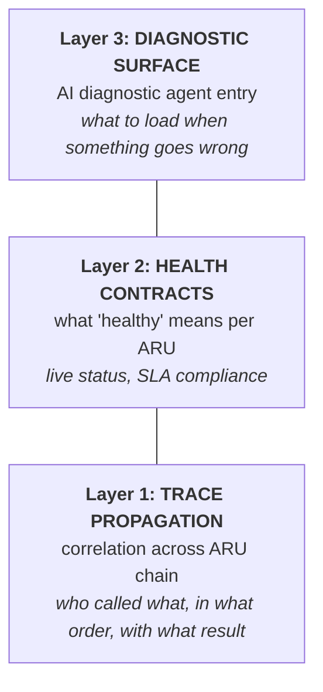
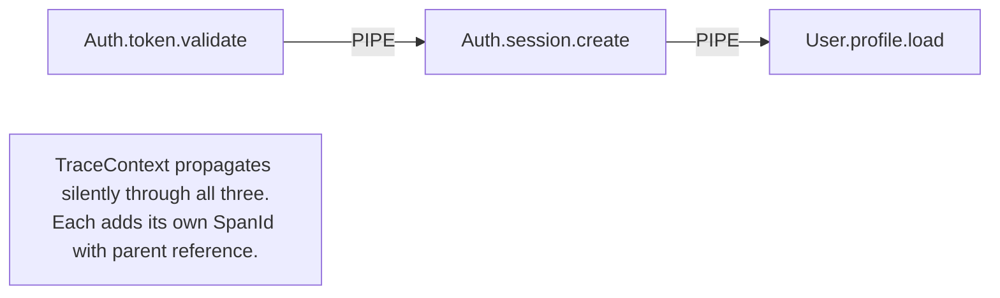
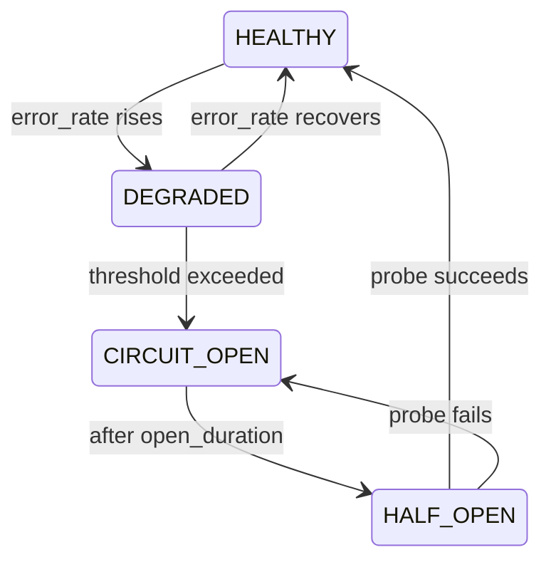

# Observability
### Fourth Iteration — Trace propagation, health contracts, and AI diagnostic surfaces

---

## Why Observability Is First-Class

The OBSERVE composition pattern (`03-composition-patterns.md`) handles per-ARU telemetry. But that alone answers only *"this ARU emitted this event."* It cannot answer:

- *"Why did this request fail?"* (requires trace across 7 ARUs)
- *"Is this ARU healthy right now?"* (requires a health contract)
- *"What context does an AI agent need to diagnose this anomaly?"* (requires a diagnostic surface)

Observability in ARIA is a **structural concern**, not an operational afterthought. It is designed into the architecture so that both runtime monitoring systems and AI diagnostic agents can reason about the system with the same precision as AI development agents.

---

## The Three Observability Layers



---

## Layer 1: Trace Propagation

### The Correlation ID Contract

Every execution that crosses ARU boundaries carries a **CorrelationId**. This is an L0 type:

```
CorrelationId = branded string
TraceContext = {
  correlationId: CorrelationId
  parentSpanId:  SpanId | RootSpan
  spanId:        SpanId
  originARU:     ARU_id
  depth:         PositiveInteger   ← how deep in the call chain
}
```

### Propagation Rules

**Rule 1: CorrelationId is created once at L4/L5 entry points, never inside L1–L3.**

The System (L4) or Domain surface (L5) that receives an external request generates the CorrelationId. All downstream ARUs receive and propagate it. An L1 Atom that generates its own CorrelationId is an architectural violation.

**Rule 2: TraceContext propagates through PIPE chains automatically.**

The composition system injects TraceContext as a side-channel — ARUs do not declare it as part of their input/output types. It is invisible to the ARU contract but present in the execution frame.



**Rule 3: FORK propagates the same CorrelationId to all branches.**
**Rule 4: JOIN merges spans under the same CorrelationId.**
**Rule 5: OBSERVE emits events tagged with the current TraceContext.**

### The Trace Record

Every ARU execution automatically produces a trace record via OBSERVE:

```yaml
trace_record:
  correlation_id: "cid-a3f9b2"
  span_id: "spn-00123"
  parent_span_id: "spn-00122"
  aru_id: "auth.token.validate"
  layer: L1
  
  timing:
    started_at: "2026-03-12T22:54:01.123Z"
    duration_ms: 4.2
    
  result:
    track: "SUCCESS"            # SUCCESS | FAILURE
    output_type: "ValidatedToken"
    
  on_failure:
    error_type: "AuthError.EXPIRED"
    rail_error_id: "re-00456"   # links to full RailError record
    
  behavioral:
    within_latency_p99: true    # compared against behavioral_contract
    retry_attempt: 0
```

This record is emitted regardless of success or failure. It requires no developer instrumentation — it is produced by the composition system, not the ARU implementation.

---

## Layer 2: Health Contracts

### What "Healthy" Means Per ARU Type

Different ARU types have different health semantics:

| ARU Type | Healthy Definition |
|---|---|
| L0 Primitive | Always healthy (no runtime) |
| L1 Atom (pure) | Always healthy if it compiles |
| L1 Atom (I/O) | `error_rate_1m < 1%` AND `p99_latency < behavioral_contract.max_latency_p99` |
| L2 Molecule | All component atoms healthy AND molecule `error_rate_5m < 2%` |
| L3 Organism | All component molecules healthy AND business rule error rate within policy |
| L4 System | All component organisms healthy AND pipeline completion rate > threshold |
| L5 Domain | All systems healthy AND external SLA targets met |

### Health Contract Declaration

Each ARU with runtime behavior declares a health contract:

```yaml
health_contract:
  error_rate_threshold:
    window: "1m"
    max_percent: 1.0            # > 1% errors in 1min = DEGRADED
    
  latency_threshold:
    p99_max_ms: 15              # from behavioral_contract — auto-populated
    evaluation_window: "5m"
    
  availability_target:
    min_percent: 99.9           # over rolling 30 days
    
  degraded_behavior:            # what the system does when this ARU is DEGRADED
    strategy: "CIRCUIT_BREAK"   # CIRCUIT_BREAK | FALLBACK | RETRY | FAIL_FAST
    fallback_aru: "auth.token.validate.cached"   # optional — if FALLBACK strategy
    
  alert_on:
    - condition: "error_rate_5m > 5%"
      severity: "CRITICAL"
    - condition: "p99_latency > 50ms"
      severity: "WARNING"
```

### Health State Machine

Each runtime ARU is in one of four health states at any moment:



The health state of each ARU is available via the graph index as a live overlay — the same structure as the static graph, but with current health states on each node.

---

## Layer 3: The Diagnostic Surface

### What an AI Diagnostic Agent Needs

When something goes wrong in production, a human notices a symptom (e.g., "login is failing for 30% of users"). An AI diagnostic agent is invoked. It needs to:

1. Identify which ARUs are on the code path for the failing scenario
2. Narrow to which ARU(s) have anomalous behavior
3. Load enough context to reason about why
4. Propose a fix or escalate to a human

Without a defined diagnostic surface, step 1 alone could require reading thousands of tokens of irrelevant code. The diagnostic surface is the observability equivalent of the minimum subgraph — the exact set of context needed for diagnosis.

### Diagnostic Surface Specification

Each ARU's manifest includes a `diagnostic_surface` section:

```yaml
diagnostic_surface:
  # What to look at first when this ARU is suspected
  primary_signal:
    metric: "error_rate_1m"
    trace_field: "result.track"
    
  # What context a diagnostic AI needs to load
  diagnostic_context:
    to_identify_issue: 
      load: ["manifest.contract", "manifest.behavioral_contract", "recent_trace_records"]
      tokens: ~300
    to_diagnose_root_cause:
      load: ["implementation", "dependency_contracts", "trace_records_with_failure_rail"]
      tokens: ~800
    to_propose_fix:
      load: ["to_diagnose_root_cause", "layer_neighbors", "type_state_machine"]
      tokens: ~1400
      
  # Common failure patterns and their signatures in traces
  known_failure_patterns:
    - name: "token_clock_skew"
      signature: "AuthError.EXPIRED with duration_ms < 1 AND token_age < 5s"
      fix_hint: "Check server clock synchronization; consider adding clock_skew_tolerance"
      
    - name: "jwt_library_version_mismatch"
      signature: "AuthError.INVALID_SIGNATURE with valid token from external issuer"
      fix_hint: "Check crypto.jwt.decode version against issuer's algorithm"
```

### Known Failure Patterns

The `known_failure_patterns` section is the ARU's institutional memory. Each time a novel failure occurs and is diagnosed, the pattern is added. Future AI diagnostic agents benefit from all previous diagnoses without needing to re-discover them.

This is a **feedback loop from production to architecture**: production failures enrich the diagnostic surface, which improves AI diagnostic accuracy, which reduces mean time to resolution.

---

## The Observability Graph

Just as the Semantic Graph maps development-time structure, the **Observability Graph** maps runtime behavior. It is the same DAG with additional overlays:

```
Static Semantic Graph:
  nodes = ARUs
  edges = composition patterns

Observability Graph (live overlay):
  nodes = ARUs + current health state + error rate + p99 latency
  edges = composition patterns + trace flow + event emissions
```

An AI diagnostic agent loads the Observability Graph instead of the Semantic Graph when investigating production issues. It sees not just *"these ARUs are connected"* but *"these ARUs are connected AND this one has a 12% error rate AND the traces show failures starting 4 minutes ago."*

### Observability Graph Queries

| Query | Use Case |
|---|---|
| `unhealthy_nodes()` | Find all ARUs not in HEALTHY state |
| `anomaly_path(symptom_aru)` | Trace upstream from an unhealthy ARU to find root cause |
| `affected_by(aru_id)` | Find all downstream ARUs that would be impacted by a failure |
| `trace_replay(correlation_id)` | Reconstruct the full execution path of a specific request |
| `compare_traces(baseline_cid, anomaly_cid)` | Diff two execution paths to find divergence point |

### Diagnostic Protocol for AI Agents

```
Step 1:  Load Observability Graph (health states + live metrics)
Step 2:  Call unhealthy_nodes() → identify degraded ARUs
Step 3:  Call anomaly_path() from most impactful unhealthy node
         → produces ordered list of suspect ARUs
Step 4:  Load suspect ARU diagnostic_surface at "to_identify_issue" level
Step 5:  Check known_failure_patterns against recent trace data
         → if pattern matches: propose known fix
         → if no pattern: escalate to "to_diagnose_root_cause" level
Step 6:  Load implementation context only if root cause is not identifiable from
         traces + behavioral contract
Step 7:  Produce structured diagnosis:
           affected_aru, failure_pattern, root_cause, proposed_fix, confidence
Step 8:  If confidence < threshold: escalate to human with diagnostic context loaded
```

This protocol means AI diagnostic agents, like development agents, load only the minimum context needed. A production issue that matches a known pattern is diagnosed in < 400 tokens. Only novel failures require deep implementation reads.

---

## Connection to the Development Cycle

Observability is not separate from development — it is built in at ARU creation time:

1. **Generator** creates the ARU with a `diagnostic_surface` stub
2. **Reviewer** checks that health contract thresholds match behavioral contract declarations
3. **TraceContext propagation** is automatic (no developer instrumentation)
4. **Known failure patterns** are populated as the ARU matures in production
5. **Diagnostic surface** is part of the manifest bundle — loaded by AI diagnostic agents at session start

The result: every ARU is observable from day one, and observability improves automatically as the system learns from production experience.
