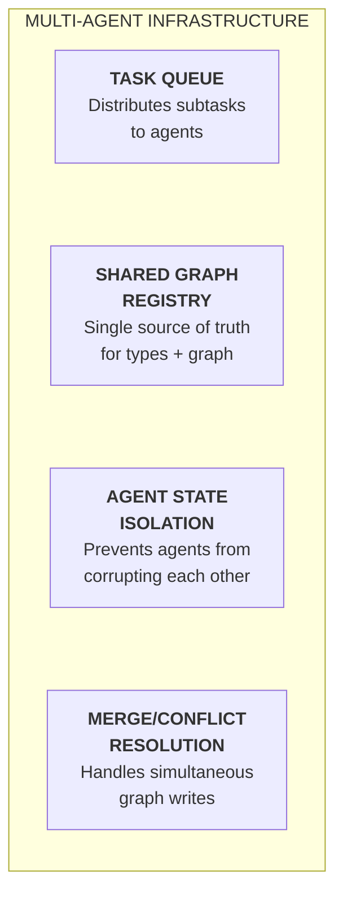

# Multi-Agent Infrastructure
### Fourth Iteration — The coordination layer for parallel AI development

---

## The Gap Between Theory and Current Reality

ARIA's task decomposition grammar (`15-task-decomposition.md`) describes parallel subtask execution by multiple agents. The agent roles (`16-ai-agent-roles.md`) define five specialized agents. But the infrastructure that makes these agents actually coordinate — the shared type registry, the task queue, the graph merge protocol, the conflict resolution system — has not yet been specified.

This document bridges theory and near-term implementation. It distinguishes what is possible today from what the full vision requires, and defines the minimal viable infrastructure for each.

---

## Infrastructure Components



---

## Component 1: Task Queue

**Purpose:** Distribute ready subtasks to available agents based on role, dependency resolution, and current work.

### Readiness Definition

```
ready_subtasks = all subtasks where:
  status == 'PENDING'
  AND all(dep.status == 'DONE' for dep in depends_on)
```

A subtask becomes ready the moment its last dependency completes — the queue is event-driven, not polled.

### Assignment Rules

```yaml
assignment_rules:
  - subtask_type: [TYPE_ADDITION, TYPE_STATE_ADDITION]
    assignable_to: HUMAN
    queue_behavior: "pause dependent subtasks until human completes"

  - subtask_type: [ARU_CREATION, ARU_MODIFICATION]
    assignable_to: GENERATOR
    max_parallel: unbounded   # generators are stateless; parallelize freely

  - subtask_type: [GRAPH_REWIRE, ARU_VERSION, MIGRATION_CREATION]
    assignable_to: REFACTORER
    max_parallel: 1           # graph structure changes must serialize

  - subtask_type: [GRAPH_EDGE_ADD]
    layer: [L5]
    assignable_to: HUMAN

  - subtask_type: [GRAPH_EDGE_ADD]
    layer: [L4]
    assignable_to: GENERATOR
    requires_human_approval: true   # L4 system topology is collaborative per doc 14
    approval_event: "CANDIDATE_GRAPH_EDGE_L4"

  - subtask_type: [GRAPH_EDGE_ADD]
    layer: [L1, L2, L3]
    assignable_to: GENERATOR
```

### Near-Term Implementation

Today, the task queue is a YAML file managed by the Orchestrator agent in a human-driven session. The Orchestrator reads the file, identifies ready subtasks, invokes agents, and writes results back. No separate service required.

---

## Component 2: Shared Graph Registry

**Purpose:** Single source of truth for the semantic graph, type registry, and manifest bundle. Consistency is critical — stale data causes agents to make incorrect decisions.

### Registry Structure

```
registry/
  graph_index.json           ← DAG structure, edge types, node metadata
  manifest_bundle/
    {aru_id}.manifest.yaml   ← one file per ARU
  type_registry/
    {domain}/
      {entity}.type.yaml     ← L0 type definitions
      {entity}.states.yaml   ← L0 state machines
  tombstones/
    {aru_id}.tombstone.yaml  ← retained forever; address never reused
  bundle_version             ← sha256 of current state
```

### Read Protocol (all agents)

1. Load `bundle_version` hash
2. Compare to session-cached version
3. If different: reload affected manifests before proceeding
4. If same: use session cache

### Write Protocol (Generator / Refactorer)

```
1. Acquire optimistic lock on affected ARU semantic addresses
2. Write new/updated manifest or graph edge
3. Run type compatibility check on all affected edges
4. If passes: commit, release lock, increment bundle_version
5. If fails:  rollback write, release lock, return structured error to agent
```

Two generators writing different ARUs are never blocked. Two generators writing the same ARU serialize automatically by lock.

### Near-Term Implementation

**A git repository is a complete shared graph registry today.**
- `bundle_version` = commit SHA
- Write locking = PR/branch merge
- Type compatibility checks = CI pipeline
- Agent isolation = feature branches named by subtask id

This maps exactly to current developer workflows with zero new tooling.

---

## Component 3: Agent State Isolation

**Purpose:** An agent's in-progress DRAFT work must never affect other agents' view of the registry.

### Isolation Invariants

1. DRAFT ARUs are never in the shared manifest bundle
2. A DRAFT ARU never appears in any other agent's minimum subgraph query
3. Agents on independent subtasks never block each other
4. An agent failure leaves no corrupted state in the shared registry (all writes are transactional)

### Isolation Model

```
Agent A (subtask t03):  sees current registry + A's DRAFT auth.oauth.validate
Agent B (subtask t08):  sees current registry + B's DRAFT auth.oauth.handleError
                        ← A and B are invisible to each other
```

When A's work is CANDIDATE (Reviewer approved), it enters the shared registry and becomes visible to B for dependency resolution.

### Near-Term Implementation

Git branches per subtask. DRAFT = local branch. CANDIDATE = open PR (reviewed). STABLE = merged to main and pulled by others.

---

## Component 4: Merge and Conflict Resolution

### Conflict Types

| Type | Example | Resolution |
|---|---|---|
| **Name collision** | Two agents create same semantic address | Task decomposition bug; Orchestrator reassigns one |
| **Type incompatibility** | Agent A's output type doesn't match Agent B's expected input | Type checker on merge; Refactorer resolves |
| **Dependency order violation** | Agent B references Agent A's ARU before it's CANDIDATE | Queue ordering prevents this; if occurs, B is blocked |
| **Behavioral contract conflict** | Two agents set different rate limits on the same ARU | Human decision required |

### Resolution Protocol

```
1. Type checker runs on every merge (automatic, CI)
2. No conflicts → merge succeeds; bundle_version incremented
3. Type incompatibility → Refactorer invoked with both ARUs + structured error
                        → Refactorer proposes fix → Reviewer validates
4. Behavioral conflict → Human notification with both values + context
5. Name collision     → Orchestrator reviews decomposition; one address reassigned
```

### Conflict Probability in Practice

In a well-formed task decomposition:
- Each subtask has a unique target declared before execution begins
- The dependency DAG serializes logically-conflicting subtasks
- L0 changes are human-gated, preventing most semantic conflicts

Conflicts are edge cases. The protocol handles them; it is not the common path.

---

## Near-Term vs. Full Vision

| Capability | Near-Term (today) | Full Vision |
|---|---|---|
| Task queue | YAML file + Orchestrator in one session | Event-driven queue service with agent pool |
| Shared registry | Git repository + CI type checks | Live graph service with real-time consistency |
| Agent state isolation | Git branches per subtask | Ephemeral workspaces with automatic cleanup |
| Conflict resolution | CI failures + human or Refactorer agent | Auto-resolution for type conflicts |
| Parallel execution | Sequential within a session | True concurrent agent pool |
| Orchestrator | Single AI agent per session | Persistent scheduling service |

The near-term implementation delivers the majority of ARIA's efficiency gains using tools that exist today. The full vision is a multi-year infrastructure build. Crucially, the architectural decisions made in the near-term are subsets of the full vision — nothing needs to be undone as infrastructure matures.

---

## The Minimal Viable Multi-Agent Session (Today)

A human can run a multi-agent ARIA workflow right now using three concurrent sessions:

```bash
# Session 1: Orchestrator — produces and tracks the decomposition
cat task-description.md | claude -p "Run task decomposition grammar. Output subtask YAML."

# Session 2: Generator — invoked per ready subtask
cat subtask-t03.yaml context_bundle.md | claude -p "Generate ARU per subtask spec."

# Session 3: Reviewer — invoked after each Generator output
cat generated-aru.ts subtask-t03.yaml | claude -p "Run review checklist. Output APPROVED or REJECTED with structured feedback."
```

The human acts as the task queue: reading Orchestrator output, invoking Generator with ready subtasks, passing Generator output to Reviewer, and feeding Reviewer feedback back to Generator on rejection. As agent tooling matures, each of these human steps is replaced by automated routing — but the protocol is identical.
